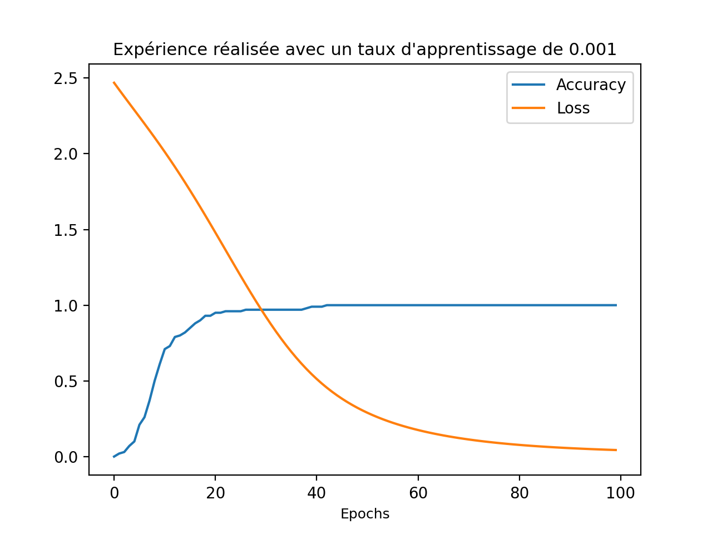
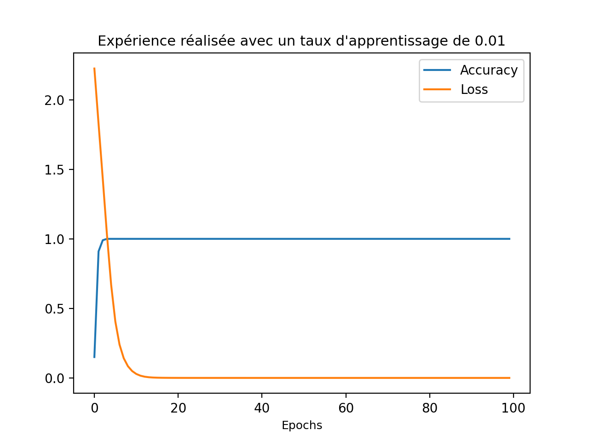
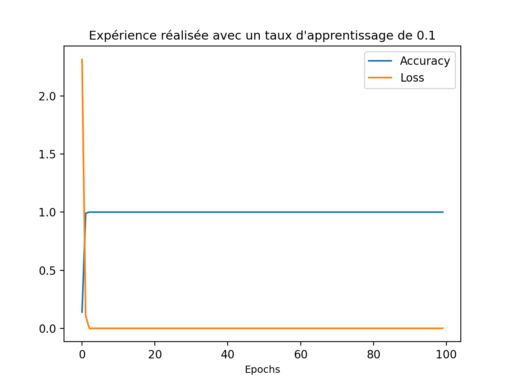

# Deep_learning_pytorch_intro

# Explication détaillée du code :

## Première partie: Definition de la classe Net

On commence par définir notre classe Net du module NeuralNet de Pytorch, qui représente le réseau de neuronnes.

Pour que cette classe soit bien definie, vu qu'on veut faire un model de feed-forward, deux fonctions sont nécessaires:

    -  La fonction _init()_ qui nous permet d'initialiser les hyperparamètres de notre modèle, à savoir le nombre des entrées et sorties.
    Dans notre cas, on a deux couches cachées linéaires.

    - La fonction _forward()_ qui décrit comment l'information se propage dans le réseau de neuronnes. Après la première couche, on applique
    une fonction d'activation linéaire _tanh()_ (c'est une fonction principalement utilisée pour la classification entre deux classes.)
## Deuxième partie: Entrainement et évaluation du modèle
Les fonctions _train()_ et _test()_ sont deux fonctions utilisées respectivement pour entrainer et évaluer le modèle.

    - La fonction _train()_: Elle prend comme paramètres: 
        - le model utilisé pour réaliser l'apprentissage,
        - les données sur lesquelles le système va apprendre,
        - la target qui est la cible, 
        - le nombre d'epochs c'est à dire le nombre d'itérations,
        - le learning rate qu'on verra par le suite son impact sur les résultats et surtout sur le calcul de la perte (loss function).
    Pendant cette phase d'entrainement, on prend un optimiseur qui est utilisé pour diminuer les taux d'erreur lors de la formation des
    réseaux de neuronnes. L'optimiseur Adam est défini comme un processus utilisé comme optimiseur de remplacement pour la descente de 
    gradient. Il est très efficace pour les problèmes de grande taille qui comprennent beaucoup de données. On utilise comme critère de
    perte l'entropie croisée qui calcule la perte d'entrepie entre la cible et la valeur de sortie (prédite)

    - On convertit nos entrées et cibles en tenseur avant d'entrainer le model sur le nombre d'epochs. 
    - À chaque epoch: on fait un shuffle de nos données pour s'assurer que notre modèle ne "voit" pas les données toujours dans le même sens
    (permet notamment de diminuer le risque de surapprentissage). On calcule ensuite la perte et la precision à l'epoch courante. La 
    precision est obtenue par évaluation du modèle sur les données de test. Enfin on fait de l'étape de retropropagation pour mettre à jour
    les poids associés à chaque donnée.

## Troisième partie: Génération des données
La fonction _gendata()_ a comme objectif la génération des données. Ici on choisit comme entrée _f(x,y)=log(x+y)_ et comme cible y2 qui est un vecteur de 0 et de 1 (2 classes supposées). Les paramètres x et y de la fonction f sont générés de façon uniforme et aléatoire.
La fonction _gendata()_ renvoie alors f appliquée à x et y, et y2

## Quatrième partie: Expérience
Dans le main, on fait appel à _toytest()_. Dans cette fonction, on réalise les différentes expériences. On définit les 
hyperparamètres du modèle et on fait l'entrainement du modèle

# Résultats

# Analyse
Dans les 4 expériences réalisées, le modèle de feed-forward entrainé arrive toujours, ou presque à apprendre notre fonction. En effet, la
précision du modèle croit toujours et arrive à 1 lors des 3 expériences, sauf pour un taux d'apprentissage de 0.001 où on arrive très peu de
fois à 0.99. Cependant, en repetant l'expérience avec le taux d'apprentissage constant égale à 0.001, on arrive à une precision de 100%. 
On a choisit de garder les mêmes données entre les expériences.
On s'est amusés à chronométrer le temps que prend notre modèle pour apprendre la fonction f à chaque expérience, et les temps sont variables.
On a constaté qu'entre la 1ère (lr=0.001) et la 2ème expérience (lr=0.01), ce temps a diminué mais après ne fait qu'augmenter (on a répété 
l'expérience plusieurs fois et c'est quasiment toujours ainsi que cela se présente).
Aussi, on a mesuré le nombre d'epochs que necessite le modèle pour atteindre le maximum de précision. Celui décroit généralement, mais il
augmente quasiment toujours quand on passe à un taux d'apprentissage de 1.0.
Une remarque intéréssante est que plus le taux d'apprentissage est grand, moins la précision augmente rapidement entre les epochs, sauf 
quelques fois avec un taux d'apprentissage de 1.0 où on peut avoir quelques perturbations.